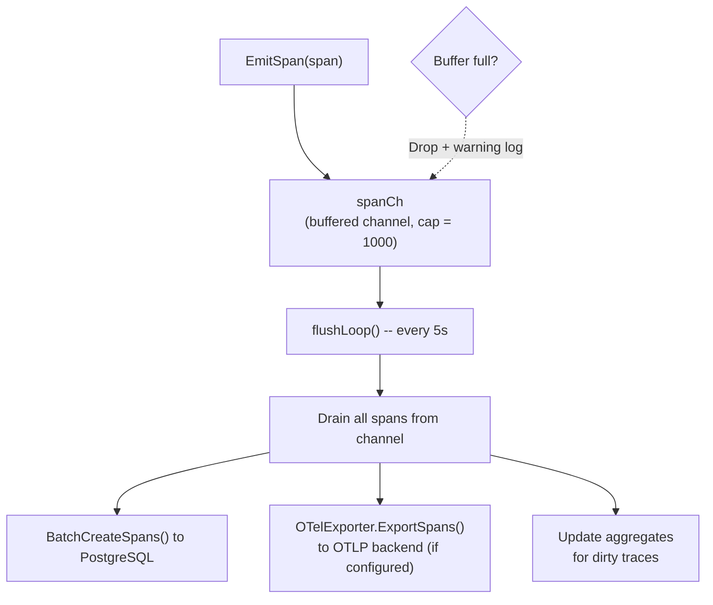
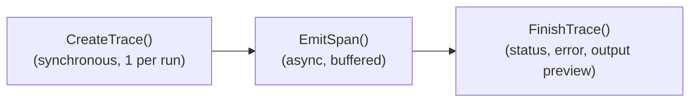
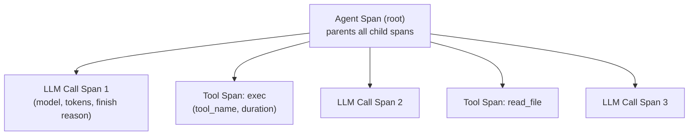
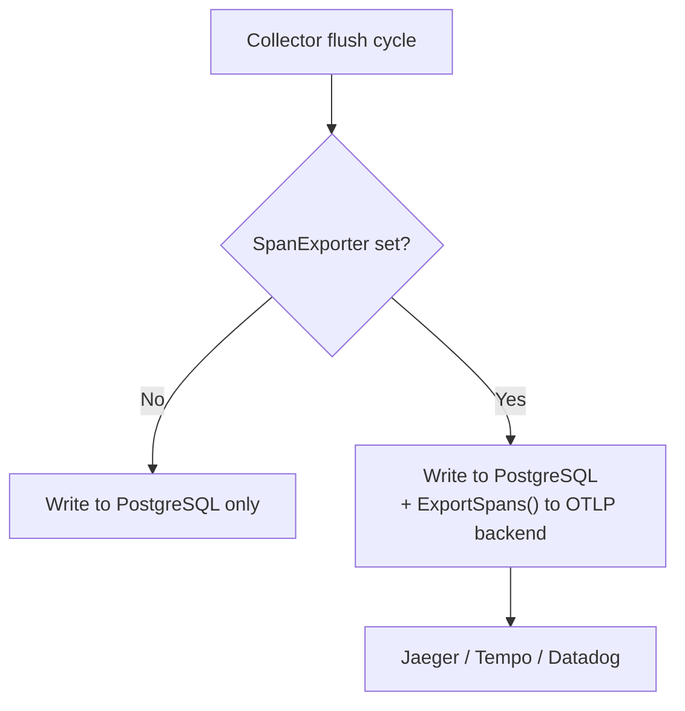

# 10 - Tracing & Observability

Records agent run activities asynchronously. Spans are buffered in memory and flushed to the TracingStore in batches, with optional export to external OpenTelemetry backends.

> **Managed mode only**: Tracing requires PostgreSQL. In standalone mode, `TracingStore` is nil and no traces are recorded. The `traces` and `spans` tables store all tracing data. Optional OTel export sends spans to external backends (Jaeger, Grafana Tempo, Datadog) in addition to PostgreSQL.

---

## 1. Collector -- Buffer-Flush Architecture

### Trace Lifecycle

---

## 2. Span Types & Hierarchy

| Type | Description | OTel Kind |
|------|-------------|-----------|
| `llm_call` | LLM provider call | Client |
| `tool_call` | Tool execution | Internal |
| `agent` | Root agent span (parents all child spans) | Internal |

### Token Aggregation

Token counts are aggregated **only from `llm_call` spans** (not `agent` spans) to avoid double-counting. The `BatchUpdateTraceAggregates()` method sums `input_tokens` and `output_tokens` from spans where `span_type = 'llm_call'` and writes the totals to the parent trace record.

---

## 3. Verbose Mode

| Mode | InputPreview | OutputPreview |
|------|:---:|:---:|
| Normal | Not recorded | 500 characters max |
| Verbose (`GOCLAW_TRACE_VERBOSE=1`) | Up to 50KB | 500 characters max |

Verbose mode is useful for debugging LLM conversations. Full input messages (including system prompt, history, and tool results) are serialized as JSON and stored in the span's `InputPreview` field, truncated at 50,000 characters.

---

## 4. OTel Export

Optional OpenTelemetry OTLP exporter that sends spans to external observability backends.

### OTel Configuration

| Parameter | Description |
|-----------|-------------|
| `endpoint` | OTLP endpoint (e.g., `localhost:4317` for gRPC, `localhost:4318` for HTTP) |
| `protocol` | `grpc` (default) or `http` |
| `insecure` | Skip TLS for local development |
| `service_name` | OTel service name (default: `goclaw-gateway`) |
| `headers` | Extra headers (auth tokens, etc.) |

### Batch Processing

| Parameter | Value |
|-----------|-------|
| Max batch size | 100 spans |
| Batch timeout | 5 seconds |

The exporter lives in a separate sub-package (`internal/tracing/otelexport/`) so its gRPC and protobuf dependencies are isolated. Commenting out the import and wiring removes approximately 15-20MB from the binary. The exporter is attached to the Collector via `SetExporter()`.

---

## 5. Trace HTTP API (Managed Mode)

| Method | Path | Description |
|--------|------|-------------|
| GET | `/v1/traces` | List traces with pagination and filters |
| GET | `/v1/traces/{id}` | Get trace details with all spans |

### Query Filters

| Parameter | Type | Description |
|-----------|------|-------------|
| `agent_id` | UUID | Filter by agent |
| `user_id` | string | Filter by user |
| `status` | string | Filter by status (running, success, error) |
| `from` / `to` | timestamp | Date range filter |
| `limit` | int | Page size (default 50) |
| `offset` | int | Pagination offset |

---

## File Reference

| File | Description |
|------|-------------|
| `internal/tracing/collector.go` | Collector buffer-flush, EmitSpan, FinishTrace |
| `internal/tracing/context.go` | Trace context propagation (TraceID, ParentSpanID) |
| `internal/tracing/otelexport/exporter.go` | OTel OTLP exporter (gRPC + HTTP) |
| `internal/store/tracing_store.go` | TracingStore interface |
| `internal/store/pg/tracing.go` | PostgreSQL trace/span persistence + aggregation |
| `internal/http/traces.go` | Trace HTTP API handler (GET /v1/traces) |
| `internal/agent/loop_tracing.go` | Span emission from agent loop (LLM, tool, agent spans) |

---

## Cross-References

| Document | Relevant Content |
|----------|-----------------|
| [01-agent-loop.md](./01-agent-loop.md) | Span emission during agent execution |
| [06-store-data-model.md](./06-store-data-model.md) | traces/spans tables schema |
| [09-security.md](./09-security.md) | Rate limiting, RBAC access control |
